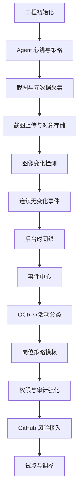

# 远程员工工作行为与代码风险监控系统开发计划

## 1. 计划结论

本项目建议按 10 周完成 MVP，采用分阶段交付：

1. 第 1-2 周：打通 C#/.NET Agent 截图上传链路。
2. 第 3-4 周：完成截图变化检测和连续无变化事件。
3. 第 5-6 周：完成后台基础管理、员工时间线、事件中心。
4. 第 7 周：完成 OCR 与活动分类。
5. 第 8 周：完成 GitHub 基础风险接入。
6. 第 9 周：完成权限、审计、策略模板、告警。
7. 第 10 周：联调、压测、试点、修复和上线准备。

MVP 首要目标不是把所有风险都识别完，而是稳定跑通：

> 公司电脑 Agent -> 截图/元数据上传 -> 变化检测 -> 连续无变化事件 -> 后台时间线和事件复核。

## 2. 范围

### 2.1 MVP 包含

- Windows C#/.NET Agent。
- Windows Service + User Session Helper 架构。
- 截图、多屏截图、前台窗口、键鼠活动计数、锁屏/RDP 状态。
- 本地缓存、断网补传、心跳、策略拉取。
- 后端上传 API。
- PostgreSQL 数据模型。
- MinIO/对象存储。
- Redis 队列。
- OpenCV 图像变化检测。
- 连续 N 次无变化事件状态机。
- React 后台管理。
- 员工、设备、策略、事件、时间线。
- 原图查看权限和审计。
- 基础 OCR 与活动分类。
- GitHub 基础活动和风险事件。

### 2.2 MVP 不包含

- 自研远控。
- 记录具体按键内容。
- 摄像头/麦克风。
- 员工私人设备采集。
- 自动绩效裁决。
- 全量多模态 AI 分析。
- 完整 DLP。
- 复杂离职风险画像。

## 3. 技术决策

### 3.1 已选技术栈

| 模块 | 技术 |
| --- | --- |
| Windows Agent | C#/.NET Worker Service + User Session Helper + WPF/WinUI 托盘 |
| 后端 API | Python FastAPI |
| 异步任务 | Redis + RQ/Celery |
| 数据库 | PostgreSQL |
| 对象存储 | MinIO，后续可替换云 OSS/COS/S3 |
| 图像处理 | OpenCV + imagehash/scikit-image |
| OCR | PaddleOCR |
| 前端 | React + TypeScript |
| UI | Ant Design |
| 图表 | Apache ECharts |
| 部署 | Docker Compose |

### 3.2 Agent 架构决策

不能只做一个 Windows Service。Windows Service 默认运行在 Session 0，不适合直接采集当前远程桌面画面。

Agent 必须拆成：

```text
Windows Service
- 设备注册
- 心跳
- 策略拉取
- 上传队列
- 本地缓存
- 日志
- 自动更新预留

User Session Helper
- 截图
- 多屏识别
- 前台窗口
- 键鼠活动计数
- 锁屏/RDP 状态
- 托盘提示
```

Service 和 Helper 之间通过本机 IPC 通信，MVP 可选 Named Pipe 或 localhost loopback。

## 4. 团队配置建议

### 4.1 最小团队

| 角色 | 人数 | 职责 |
| --- | --- | --- |
| C# Agent 工程师 | 1 | Windows Agent、截图、窗口、键鼠、上传、本地缓存 |
| 后端工程师 | 1 | FastAPI、数据库、队列、事件规则、GitHub 接入 |
| 前端工程师 | 1 | React 后台、时间线、事件中心、图表 |
| 测试/QA | 0.5-1 | 安装、采集、误判样本、后台权限、联调测试 |

最小团队可 4 人左右完成 MVP。

### 4.2 推荐团队

| 角色 | 人数 | 职责 |
| --- | --- | --- |
| 技术负责人 | 1 | 架构、接口、质量门禁、代码评审 |
| C# Agent 工程师 | 2 | Service/Helper 拆分、截图/系统状态、上传/缓存/安装包 |
| 后端工程师 | 2 | API/数据模型/队列/事件规则/GitHub |
| 前端工程师 | 1-2 | 后台管理、图表、时间线、权限页 |
| 测试/QA | 1 | 自动化和手工验证 |
| 产品/项目负责人 | 1 | 需求验收、策略配置、试点反馈 |

推荐团队可 8-10 周完成质量更稳的 MVP。

## 5. 阶段计划

### 阶段 0：项目初始化与工程基线

时间：第 1 周前 1-2 天

目标：建立可持续开发的工程骨架。

任务：

- 初始化仓库结构。
- 初始化后端 FastAPI 项目。
- 初始化前端 React 项目。
- 初始化 C# Agent 解决方案。
- 配置 Docker Compose：PostgreSQL、Redis、MinIO。
- 配置基础 lint、format、测试命令。
- 定义 OpenAPI 草案。
- 定义数据库迁移方案。

交付物：

- `agent/` C# 解决方案。
- `backend/` FastAPI 项目。
- `frontend/` React 项目。
- `deploy/docker-compose.yml`。
- `.env.example`。
- 基础 README。

验收标准：

- 本地一条命令启动后端依赖。
- 后端健康检查接口可访问。
- 前端首页可访问。
- Agent 项目可编译。

## 6. 阶段 1：Agent 采集与上传链路

时间：第 1-2 周

目标：公司电脑能稳定采集截图和元数据，并上传到后台。

### 6.1 Agent Service

任务：

- 设备 ID 生成与持久化。
- 心跳上报。
- 策略拉取。
- 本地配置文件。
- 本地日志。
- 上传队列。
- SQLite 本地缓存。
- 断网重试。

验收标准：

- Agent 启动后每 30 秒心跳一次。
- 后台可看到设备在线。
- 断网后任务进入本地缓存。
- 网络恢复后自动补传。

### 6.2 User Session Helper

任务：

- 当前用户会话启动 Helper。
- 多屏幕枚举。
- 截图采集。
- 截图压缩。
- 缩略图生成。
- 前台进程名采集。
- 窗口标题采集。
- 键盘活动计数。
- 鼠标活动计数。
- 锁屏状态识别。
- RDP/远程会话状态识别。

验收标准：

- 每 10 秒生成一张截图。
- 多屏环境每个屏幕单独截图。
- 截图元数据包含进程、窗口、键鼠计数。
- 不保存具体按键内容。
- 锁屏后能识别 `is_locked=true`。

### 6.3 上传 API

任务：

- Agent 认证。
- 心跳接口。
- 策略接口。
- 截图元数据创建接口。
- 对象存储上传接口。
- 上传完成回调。
- 截图记录表。

验收标准：

- Agent 可上传截图和缩略图。
- 数据库有截图记录。
- MinIO 中有原图和缩略图。
- 后台或 API 可查最近截图列表。

## 7. 阶段 2：截图变化检测与连续无变化事件

时间：第 3-4 周

目标：判断前后截图是否有有效变化，并生成连续无变化事件。

### 7.1 图像差分 Worker

任务：

- 消费截图分析队列。
- 查询上一张同设备同屏截图。
- 读取缩略图。
- 计算 pHash/dHash。
- 计算 SSIM。
- 计算分块变化率。
- 忽略小范围变化区域。
- 写入 `screen_diffs`。

验收标准：

- 相同截图能判定 `none`。
- 页面滚动能判定 `major`。
- 光标闪烁不触发 `major`。
- 窗口切换能判定 `major`。

### 7.2 连续无变化状态机

任务：

- 维护 device + screen_index 的 streak 状态。
- 连续无变化达到 N 时生成事件。
- 持续无变化时更新事件持续时间。
- 出现有效变化时关闭事件。
- 支持不同岗位策略阈值。

验收标准：

- 默认 N=6，10 秒截图间隔下约 60 秒触发事件。
- 事件包含开始时间、结束时间、连续次数、截图、差分指标。
- 画面恢复变化后事件自动关闭。
- 同一静止区间不重复生成多条事件。

### 7.3 事件表与事件 API

任务：

- `behavior_events` 表。
- 事件列表 API。
- 事件详情 API。
- 事件状态更新 API。
- 事件复核备注。

验收标准：

- 可按员工、设备、时间、风险级别筛选事件。
- 可查看事件关联截图。
- 可标记误报、确认风险、关闭事件。

## 8. 阶段 3：后台基础管理

时间：第 5-6 周

目标：管理者能在后台查看设备、员工、截图、时间线和事件。

### 8.1 权限与登录

任务：

- 登录。
- JWT/session。
- 用户角色。
- RBAC 权限模型。
- 数据范围控制。

验收标准：

- 主管只能看直属团队。
- 安全负责人只能看安全风险范围。
- 员工本人只能看自己的摘要。
- 未授权用户不能查看原图。

### 8.2 员工与设备管理

任务：

- 员工列表。
- 员工详情。
- 岗位配置。
- 部门配置。
- 主管关系。
- 设备列表。
- 设备绑定员工。
- Agent 状态。

验收标准：

- 可创建和编辑员工。
- 可绑定设备和员工。
- 可看到设备在线/离线。
- 可按部门、岗位、主管筛选。

### 8.3 员工时间线

任务：

- 按日期查询截图。
- 按 5 或 10 分钟聚合状态。
- 展示缩略图。
- 展示活动类型、变化级别、键鼠计数。
- 展示事件标记。

验收标准：

- 主管可查看某员工一天时间线。
- 时间线上能看到连续无变化事件。
- 点击截图进入详情页。

### 8.4 事件中心

任务：

- 事件列表。
- 事件详情。
- 风险级别筛选。
- 事件复核。
- 员工说明预留。
- 事件导出预留。

验收标准：

- 能按状态处理事件。
- 能看到事件证据链。
- 复核动作写入审计日志。

## 9. 阶段 4：OCR 与活动分类

时间：第 7 周

目标：让系统能识别截图大概在做什么。

任务：

- OCR Worker。
- OCR 文本摘要。
- OCR 敏感信息脱敏。
- 应用分类规则。
- 活动类型规则。
- 置信度输出。
- 低置信度标记。
- `activity_analyses` 表。

活动类型：

- 编码。
- 代码评审。
- 终端。
- 调试。
- 文档。
- 会议。
- 沟通。
- 任务管理。
- 工作相关网页。
- 疑似无关网页。
- 桌面空闲。
- 锁屏。
- 远控断连。
- 未知。

验收标准：

- 能识别 IDE、浏览器、GitHub、会议、聊天、文档、终端。
- 每条分析有置信度。
- OCR 摘要不保存明显敏感 Token/密码。
- 低置信度不会直接标为高风险。

## 10. 阶段 5：GitHub 基础风险

时间：第 8 周

目标：把代码风险从“截图观察”扩展到 GitHub 行为。

任务：

- GitHub App 或 token 配置。
- 员工 GitHub 账号绑定。
- 同步 commit/PR/review。
- 同步 organization audit log。
- clone/fetch 风险规则。
- 权限变更风险规则。
- secret scanning 告警接入预留。
- GitHub 风险事件入库。

验收标准：

- 能看到员工 GitHub 活动。
- 能关联员工时间线。
- 大量 clone/fetch 可生成风险事件。
- 权限变更可生成风险事件。

注意：

- GitHub audit log 具体能力和保留期受 GitHub 版本影响。
- clone/fetch 事件能力需要按实际 GitHub Organization/Enterprise 权限确认。

## 11. 阶段 6：策略、审计、告警

时间：第 9 周

目标：让系统可管理、可审计、可试点。

### 11.1 策略模板

任务：

- 岗位策略模板。
- 截图间隔配置。
- 连续无变化 N 配置。
- 高风险持续时长配置。
- 应用白名单/黑名单。
- GitHub 风险权重。
- 策略变更历史。

验收标准：

- 后端、前端、测试、运维可以使用不同阈值。
- 策略修改后 Agent 可拉取新策略。
- 策略变更写入审计日志。

### 11.2 审计

任务：

- 原图查看审计。
- 截图导出审计。
- 事件复核审计。
- 策略修改审计。
- 权限修改审计。

验收标准：

- 原图查看 100% 要求填写原因。
- 每次原图查看都有审计日志。
- 审计员可查询审计记录。

### 11.3 告警

任务：

- 高风险静止事件告警。
- Agent 离线告警。
- GitHub 高风险事件告警。
- 告警去重。
- 飞书/企微 webhook 预留。

验收标准：

- 高风险事件能进入站内通知。
- 同一事件不会重复刷屏。
- 告警有处理状态。

## 12. 阶段 7：联调、试点、上线

时间：第 10 周

目标：在小范围真实环境试点，修正误判和稳定性问题。

任务：

- 5-10 台公司电脑试点。
- 远控场景测试。
- 多屏测试。
- 锁屏测试。
- 网络断开测试。
- 24 小时稳定性测试。
- 截图存储成本估算。
- 事件误报复盘。
- 权限审计检查。
- 安装包签名和分发。
- 上线手册。

验收标准：

- Agent 连续运行 24 小时无崩溃。
- 上传成功率 >= 99%。
- 分析任务 P95 延迟 <= 30 秒。
- 连续无变化事件延迟 <= 60 秒。
- 原图查看 100% 有审计。
- 试点反馈中的 P0/P1 问题已修复。

## 13. 开发任务清单

### 13.1 Agent 任务

| 编号 | 任务 | 优先级 | 验收 |
| --- | --- | --- | --- |
| A-01 | C# Agent 解决方案初始化 | P0 | 可编译，可运行 |
| A-02 | Windows Service 心跳 | P0 | 后台显示在线 |
| A-03 | User Session Helper 启动 | P0 | 用户登录后可运行 |
| A-04 | 单屏截图 | P0 | 10 秒一张截图 |
| A-05 | 多屏截图 | P0 | 多屏分别上传 |
| A-06 | 前台窗口/进程采集 | P0 | 元数据准确 |
| A-07 | 键鼠活动计数 | P0 | 只计数，不记录按键 |
| A-08 | 锁屏/RDP 状态 | P0 | 状态可识别 |
| A-09 | 本地 SQLite 缓存 | P0 | 断网可缓存 |
| A-10 | 上传队列和重试 | P0 | 恢复网络补传 |
| A-11 | 托盘状态提示 | P1 | 可看到运行状态 |
| A-12 | 安装包 | P1 | 可一键安装卸载 |
| A-13 | 自动更新预留 | P2 | 有版本检查接口 |

### 13.2 后端任务

| 编号 | 任务 | 优先级 | 验收 |
| --- | --- | --- | --- |
| B-01 | FastAPI 项目初始化 | P0 | health check |
| B-02 | 数据库迁移 | P0 | 核心表创建 |
| B-03 | Agent 认证 | P0 | 非法设备不能上传 |
| B-04 | 心跳 API | P0 | 设备状态更新 |
| B-05 | 策略 API | P0 | Agent 拉取策略 |
| B-06 | 截图上传 API | P0 | 图片和元数据入库 |
| B-07 | 队列投递 | P0 | 上传后触发任务 |
| B-08 | 图像差分 Worker | P0 | 写入 diff |
| B-09 | 连续无变化状态机 | P0 | 生成/关闭事件 |
| B-10 | 事件 API | P0 | 查询和复核 |
| B-11 | OCR Worker | P1 | 写入分析结果 |
| B-12 | GitHub 同步 | P1 | 同步活动 |
| B-13 | 审计日志 | P0 | 敏感操作留痕 |
| B-14 | 告警服务 | P1 | 高风险通知 |

### 13.3 前端任务

| 编号 | 任务 | 优先级 | 验收 |
| --- | --- | --- | --- |
| F-01 | React 项目初始化 | P0 | 可访问 |
| F-02 | 登录页 | P0 | 可登录 |
| F-03 | 布局和菜单 | P0 | 菜单完整 |
| F-04 | 员工管理 | P0 | CRUD |
| F-05 | 设备管理 | P0 | 在线状态 |
| F-06 | 截图列表 | P0 | 缩略图展示 |
| F-07 | 员工时间线 | P0 | 按日期查看 |
| F-08 | 事件中心 | P0 | 复核事件 |
| F-09 | 截图对比页 | P1 | 前后图+指标 |
| F-10 | 策略模板页 | P1 | 岗位策略 |
| F-11 | 总览仪表盘 | P1 | KPI+图表 |
| F-12 | GitHub 风险页 | P1 | 风险列表 |
| F-13 | 审计日志页 | P0 | 查看审计 |

## 14. 数据库里程碑

第一批必须建表：

- employees
- devices
- policies
- screenshots
- screen_diffs
- behavior_events
- audit_logs
- users
- roles
- permissions

第二批建表：

- activity_analyses
- github_events
- notifications
- review_notes
- policy_versions

## 15. 接口里程碑

P0 接口：

- `POST /api/agent/heartbeat`
- `GET /api/agent/policy`
- `POST /api/agent/screenshots`
- `POST /api/agent/screenshots/{id}/complete`
- `GET /api/devices`
- `GET /api/employees`
- `GET /api/employees/{id}/timeline`
- `GET /api/events`
- `GET /api/events/{id}`
- `POST /api/events/{id}/review`
- `POST /api/screenshots/{id}/view-original`

P1 接口：

- `GET /api/dashboard/summary`
- `GET /api/dashboard/activity-distribution`
- `GET /api/github/events`
- `GET /api/audit-logs`
- `POST /api/policies`
- `PUT /api/policies/{id}`

## 16. 验收指标

### 16.1 稳定性

- Agent 24 小时运行不崩溃。
- Agent CPU 平均占用可接受，不能明显影响远控体验。
- 上传成功率 >= 99%。
- 断网恢复后可补传。

### 16.2 准确性

- 相同画面无变化识别准确。
- 页面滚动、窗口切换、代码编辑识别为有效变化。
- 光标闪烁、系统时间变化不触发明显变化。
- 连续无变化事件不重复生成。

### 16.3 后台可用性

- 主管能找到某员工一天的时间线。
- 事件中心能筛选、复核、关闭事件。
- 原图查看必须有权限和理由。
- 审计员能查到原图查看记录。

### 16.4 安全合规

- 不记录具体按键内容。
- 不采集摄像头/麦克风。
- 不采集员工私人设备。
- 敏感操作有审计。
- 截图支持保留期清理。

## 17. 测试计划

### 17.1 Agent 测试

- Windows 10/11。
- 单屏/双屏。
- RDP/向日葵/ToDesk/其他远控场景。
- 锁屏/解锁。
- 网络断开/恢复。
- 长时间运行。
- 普通用户权限和管理员权限。

### 17.2 图像算法测试

样本：

- 完全相同画面。
- 光标闪烁。
- 系统时间变化。
- 页面滚动。
- 代码编辑。
- 终端输出。
- 会议软件。
- 文档阅读。
- 锁屏。
- 桌面空闲。

### 17.3 后台测试

- 权限隔离。
- 员工时间线。
- 事件筛选。
- 截图详情。
- 审计日志。
- 策略变更。
- 图表展示。

### 17.4 安全测试

- 未授权设备上传。
- 越权查看截图。
- 越权查看员工。
- 上传 URL 滥用。
- 对象存储公开访问。
- 审计绕过。

## 18. 风险与缓解

| 风险 | 影响 | 缓解 |
| --- | --- | --- |
| Service 无法直接截图 | Agent 核心不可用 | 使用 Service + User Session Helper |
| 截图量太大 | 存储成本高 | 缩略图优先、原图短留存、无变化降采样 |
| 连续无变化误判 | 管理争议 | 结合应用、键鼠、GitHub，事件需复核 |
| OCR 泄露敏感信息 | 数据风险 | OCR 摘要脱敏，全文短存或不存 |
| GitHub audit 能力受限 | 风险识别不完整 | 先做 commit/PR/review，再按权限接 audit log |
| 员工抵触 | 推广困难 | 告知制度、本人可见、事件可说明 |
| Agent 被关闭 | 数据中断 | 服务守护、离线告警、设备状态 |
| 后台越权 | 高敏数据泄露 | RBAC、数据范围、原图单独授权、审计 |

## 19. 上线策略

### 19.1 内部开发环境

- 开发人员本机 Docker Compose。
- MinIO 本地对象存储。
- 测试 Agent 指向开发 API。

### 19.2 测试环境

- 独立服务器。
- 5-10 台测试设备。
- 模拟真实远控使用。
- 每天复盘误报事件。

### 19.3 试点环境

- 选 1 个小团队。
- 明确告知采集范围。
- 试点 1-2 周。
- 校准岗位策略。
- 收集主管和员工反馈。

### 19.4 正式上线

- 分部门灰度。
- 先只开 P0 规则。
- 高风险规则先通知不处罚。
- 稳定后逐步启用 GitHub 和 DLP 风险。

## 20. 开发顺序图



## 21. 每周交付物

| 周次 | 交付物 | 验收重点 |
| --- | --- | --- |
| 第 1 周 | 工程骨架、Agent 心跳、后端依赖 | 能启动、能注册设备 |
| 第 2 周 | 截图上传链路 | 公司电脑截图能进后台 |
| 第 3 周 | 图像差分 Worker | 能判断前后变化 |
| 第 4 周 | 连续无变化事件 | N 次无变化能记录 |
| 第 5 周 | 后台员工/设备/截图 | 管理者可查看基础数据 |
| 第 6 周 | 时间线和事件中心 | 可复核异常事件 |
| 第 7 周 | OCR 和活动分类 | 能识别大致在做什么 |
| 第 8 周 | GitHub 风险接入 | 能显示代码活动风险 |
| 第 9 周 | 权限、审计、策略、告警 | 可试点 |
| 第 10 周 | 联调、压测、试点修复 | 可上线 MVP |

## 22. 开发完成定义

MVP 完成必须同时满足：

- Agent 在真实远控场景下稳定采集。
- 截图上传和补传可靠。
- 连续无变化事件可准确生成和关闭。
- 后台能查看员工时间线和事件中心。
- 主管、安全、员工本人权限隔离。
- 原图查看和导出有审计。
- 不记录具体按键内容。
- 试点环境运行稳定。
- 已知 P0/P1 问题清零。

## 23. 后续版本路线

### v1.1

- 更完整的岗位策略。
- 飞书/企微告警。
- 更多图表。
- 员工说明和申诉流程。
- 报表导出。

### v1.2

- GitHub 风险增强。
- 文件复制/压缩/USB 风险。
- 网盘/邮箱上传风险。
- 策略模拟和误报分析。

### v2.0

- 多模态模型复判。
- 智能风险摘要。
- 团队效率趋势。
- 更完整 DLP。
- Agent 自动更新和灰度发布。
