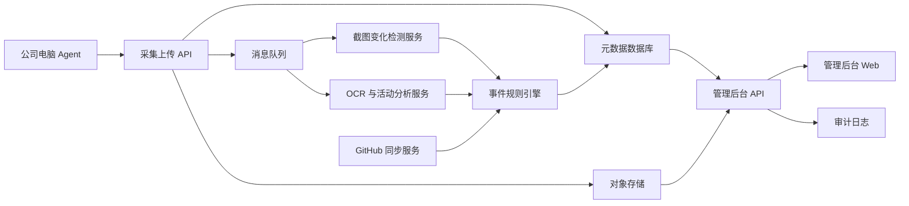
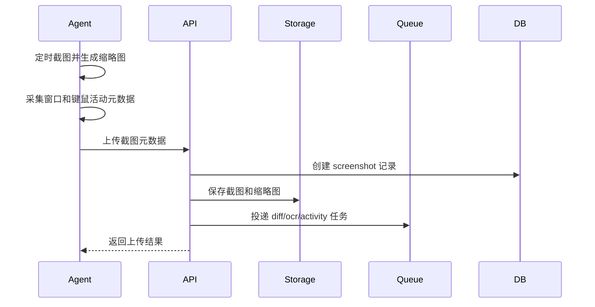
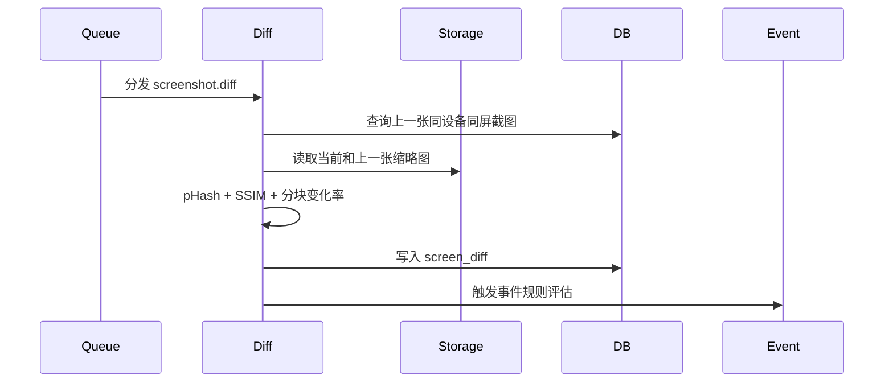
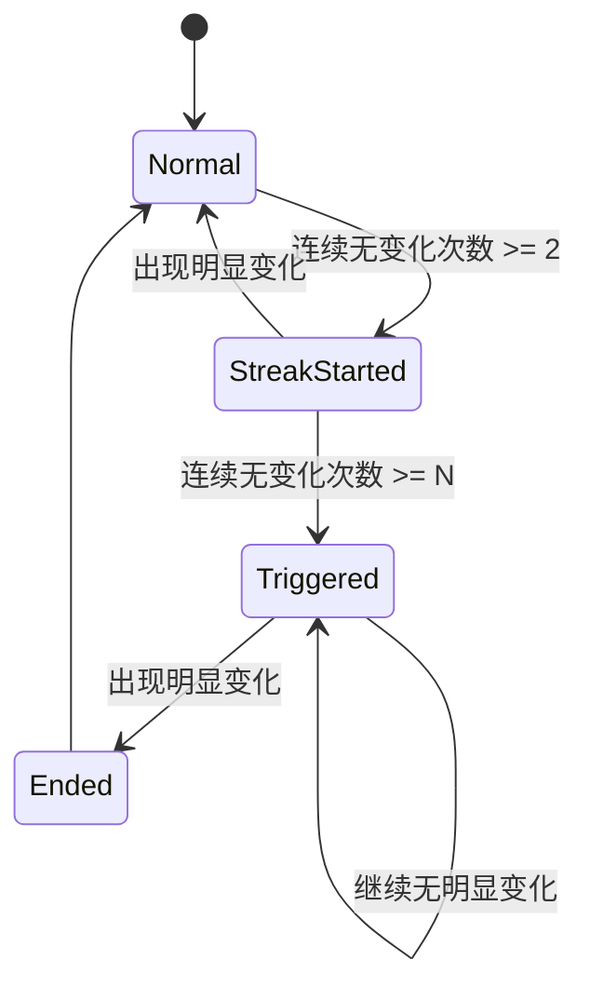

# 远程员工工作行为与代码风险监控系统技术架构

## 1. 架构目标

本系统需要在公司电脑上采集远程工作会话数据，并在后台完成截图变化检测、截图内容分析、连续无变化事件生成、GitHub 风险检测和管理端展示。

架构目标：

1. 客户端轻量稳定，不影响员工远程办公。
2. 截图采集、上传、分析、事件生成解耦。
3. 变化检测优先使用低成本算法，只有必要时才进入重分析。
4. 原图、缩略图、结构化分析结果分层存储。
5. 所有敏感查看和导出操作可审计。
6. 支持后续接入 GitHub、DLP、告警和多模态分析。

## 2. 总体架构



## 3. 核心模块

### 3.1 公司电脑 Agent

职责：

- 定时截图。
- 采集前台窗口信息。
- 采集键鼠活动计数。
- 识别锁屏和远程会话状态。
- 对截图做本地压缩和缩略图生成。
- 上传截图和元数据。
- 断网缓存与恢复补传。
- 接收策略配置。

建议形态：

- Windows Service + 托盘程序。
- Service 负责采集和上传。
- 托盘程序展示运行状态、版本、连接状态和告知信息。

MVP 默认支持 Windows。macOS/Linux 可作为后续版本。

### 3.2 采集上传 API

职责：

- 接收 Agent 心跳。
- 下发采集策略。
- 接收截图元数据。
- 接收截图文件或对象存储预签名上传结果。
- 写入截图记录。
- 投递分析任务。

### 3.3 对象存储

存储内容：

- 原始截图。
- 中分辨率截图。
- 缩略图。
- 对比图。

对象路径建议：

```text
screenshots/{employee_id}/{device_id}/{yyyy}/{mm}/{dd}/{screenshot_id}.jpg
thumbnails/{employee_id}/{device_id}/{yyyy}/{mm}/{dd}/{screenshot_id}.jpg
diffs/{employee_id}/{device_id}/{yyyy}/{mm}/{dd}/{diff_id}.jpg
```

### 3.4 消息队列

分析任务异步化，避免上传 API 被 OCR 或图像分析阻塞。

队列建议：

- screenshot.diff：截图差分任务。
- screenshot.ocr：OCR 任务。
- screenshot.activity：活动分类任务。
- event.evaluate：事件规则评估任务。
- github.sync：GitHub 数据同步任务。

### 3.5 截图变化检测服务

职责：

- 拉取当前截图和上一张截图。
- 计算感知哈希。
- 计算 SSIM。
- 计算分块变化率。
- 过滤光标、时钟、小通知等微小变化。
- 输出 change_level 和 is_effective_change。

### 3.6 OCR 与活动分析服务

职责：

- 对截图做 OCR。
- 提取窗口标题、页面标题、文件名、任务标题、GitHub PR/Issue 标题。
- 根据进程名、窗口标题、OCR 摘要和视觉特征分类活动类型。
- 输出置信度和证据摘要。

### 3.7 事件规则引擎

职责：

- 根据变化检测结果维护连续无变化 streak。
- 生成静止事件。
- 关闭静止事件。
- 生成锁屏、断连、异常应用、GitHub 风险事件。
- 计算风险级别。

### 3.8 GitHub 同步服务

职责：

- 同步 GitHub 用户、组织、仓库、PR、commit、review、audit log。
- 关联员工 GitHub 账号。
- 识别 clone/fetch、权限变更、token/key、secret scanning 等风险。

### 3.9 管理后台 API

职责：

- 员工、设备、策略、事件、截图、时间线查询。
- 原图查看权限校验。
- 审计日志写入。
- 报表和导出。

### 3.10 管理后台 Web

页面：

- 仪表盘。
- 员工时间线。
- 截图详情。
- 前后截图对比。
- 事件中心。
- GitHub 风险。
- 策略配置。
- 权限管理。
- 审计日志。

## 4. 数据流

### 4.1 截图采集流程



### 4.2 变化检测流程



### 4.3 连续无变化事件流程



## 5. 数据模型

### 5.1 employees

| 字段 | 类型 | 说明 |
| --- | --- | --- |
| id | uuid | 员工 ID |
| name | varchar | 姓名 |
| employee_no | varchar | 员工编号 |
| department | varchar | 部门 |
| manager_id | uuid | 主管 ID |
| github_username | varchar | GitHub 账号 |
| status | varchar | active/disabled/offboarded |
| created_at | timestamp | 创建时间 |
| updated_at | timestamp | 更新时间 |

### 5.2 devices

| 字段 | 类型 | 说明 |
| --- | --- | --- |
| id | uuid | 设备 ID |
| employee_id | uuid | 绑定员工 |
| hostname | varchar | 主机名 |
| os_type | varchar | 操作系统 |
| agent_version | varchar | Agent 版本 |
| screen_count | int | 屏幕数量 |
| last_heartbeat_at | timestamp | 最后心跳 |
| status | varchar | online/offline/error/disabled |
| created_at | timestamp | 创建时间 |
| updated_at | timestamp | 更新时间 |

### 5.3 screenshots

| 字段 | 类型 | 说明 |
| --- | --- | --- |
| id | uuid | 截图 ID |
| employee_id | uuid | 员工 ID |
| device_id | uuid | 设备 ID |
| captured_at | timestamp | 截图时间 |
| screen_index | int | 屏幕编号 |
| image_uri | text | 原图地址 |
| thumb_uri | text | 缩略图地址 |
| width | int | 宽 |
| height | int | 高 |
| foreground_process | varchar | 前台进程 |
| window_title | text | 窗口标题 |
| keyboard_count | int | 周期内键盘活动次数 |
| mouse_click_count | int | 周期内鼠标点击次数 |
| mouse_move_count | int | 周期内鼠标移动次数 |
| is_locked | boolean | 是否锁屏 |
| is_remote_session | boolean | 是否远程会话 |
| phash | varchar | 感知哈希 |
| upload_status | varchar | 上传状态 |
| ocr_status | varchar | OCR 状态 |
| analysis_status | varchar | 分析状态 |
| created_at | timestamp | 创建时间 |

### 5.4 screen_diffs

| 字段 | 类型 | 说明 |
| --- | --- | --- |
| id | uuid | 差分 ID |
| employee_id | uuid | 员工 ID |
| device_id | uuid | 设备 ID |
| current_screenshot_id | uuid | 当前截图 |
| previous_screenshot_id | uuid | 上一张截图 |
| hash_distance | float | 哈希距离 |
| ssim_score | float | 结构相似度 |
| changed_block_ratio | float | 变化块比例 |
| ignored_region_ratio | float | 被忽略区域比例 |
| change_level | varchar | none/minor/major/unknown |
| is_effective_change | boolean | 是否有效变化 |
| reason | text | 判断原因 |
| created_at | timestamp | 创建时间 |

### 5.5 activity_analyses

| 字段 | 类型 | 说明 |
| --- | --- | --- |
| id | uuid | 分析 ID |
| screenshot_id | uuid | 截图 ID |
| employee_id | uuid | 员工 ID |
| device_id | uuid | 设备 ID |
| active_app | varchar | 应用分类 |
| activity_type | varchar | 活动类型 |
| page_topic | text | 页面主题 |
| ocr_text_summary | text | OCR 摘要 |
| confidence | float | 置信度 |
| evidence_summary | text | 证据摘要 |
| model_version | varchar | 模型/规则版本 |
| created_at | timestamp | 创建时间 |

### 5.6 behavior_events

| 字段 | 类型 | 说明 |
| --- | --- | --- |
| id | uuid | 事件 ID |
| employee_id | uuid | 员工 ID |
| device_id | uuid | 设备 ID |
| event_type | varchar | 事件类型 |
| severity | varchar | low/medium/high/critical |
| start_at | timestamp | 开始时间 |
| end_at | timestamp | 结束时间 |
| duration_seconds | int | 持续秒数 |
| related_screenshot_id | uuid | 关联截图 |
| related_diff_id | uuid | 关联差分 |
| streak_count | int | 连续次数 |
| status | varchar | open/closed/reviewed/ignored |
| reason | text | 事件原因 |
| details_json | jsonb | 事件详情 |
| reviewed_by | uuid | 复核人 |
| reviewed_at | timestamp | 复核时间 |
| review_note | text | 复核备注 |
| created_at | timestamp | 创建时间 |
| updated_at | timestamp | 更新时间 |

### 5.7 github_events

| 字段 | 类型 | 说明 |
| --- | --- | --- |
| id | uuid | GitHub 事件 ID |
| employee_id | uuid | 员工 ID |
| github_username | varchar | GitHub 用户名 |
| repo | varchar | 仓库 |
| event_type | varchar | commit/pr/review/clone/fetch/permission/token/secret |
| occurred_at | timestamp | 发生时间 |
| ip_address | inet | IP |
| user_agent | text | User Agent |
| risk_level | varchar | 风险级别 |
| raw_json | jsonb | 原始事件 |
| created_at | timestamp | 创建时间 |

### 5.8 audit_logs

| 字段 | 类型 | 说明 |
| --- | --- | --- |
| id | uuid | 审计日志 ID |
| actor_id | uuid | 操作人 |
| action | varchar | 操作 |
| target_type | varchar | 目标类型 |
| target_id | uuid | 目标 ID |
| reason | text | 操作原因 |
| ip_address | inet | IP |
| user_agent | text | User Agent |
| created_at | timestamp | 创建时间 |

## 6. 核心算法

### 6.1 截图变化检测

输入：

- current_thumb
- previous_thumb
- current_metadata
- previous_metadata

输出：

- hash_distance
- ssim_score
- changed_block_ratio
- change_level
- is_effective_change
- reason

建议规则：

```text
if foreground_process changed:
    change_level = major
    is_effective_change = true
elif hash_distance <= 3 and ssim_score >= 0.985 and changed_block_ratio < 0.02:
    change_level = none
    is_effective_change = false
elif changed_block_ratio < 0.05 and ssim_score >= 0.95:
    change_level = minor
    is_effective_change = false
else:
    change_level = major
    is_effective_change = true
```

阈值需要通过真实样本调参。

### 6.2 分块变化检测

步骤：

1. 将缩略图缩放到固定尺寸，例如 640x360。
2. 转灰度。
3. 做轻微模糊，降低压缩噪声。
4. 切分为固定网格，例如 16x9。
5. 计算每块平均差异。
6. 忽略鼠标光标附近、小面积时间区域、任务栏时钟区域。
7. 统计变化块比例。

### 6.3 连续无变化判定

每个 device + screen_index 维护一个状态：

```text
streak_count
streak_started_at
current_event_id
last_change_at
last_screenshot_id
```

伪代码：

```text
if diff.is_effective_change:
    if current_event_id exists:
        close event
    reset streak_count
    update last_change_at
else:
    streak_count += 1
    if streak_count == 2:
        mark streak started
    if streak_count == N:
        create no_change_streak_triggered event
    if streak_count > N:
        update existing event duration and severity
```

### 6.4 活动分类

输入特征：

- foreground_process
- window_title
- OCR title
- OCR keywords
- URL domain
- UI layout hints
- previous activity

规则示例：

```text
if process in ["Code.exe", "Cursor.exe", "idea64.exe", "pycharm64.exe"]:
    active_app = IDE
    activity_type = coding
elif domain contains "github.com" and title contains "Pull Request":
    activity_type = code_review
elif process in meeting_app_list:
    activity_type = meeting
elif is_locked:
    activity_type = locked
elif process in browser and domain in unrelated_domain_list:
    activity_type = browsing_unrelated
else:
    activity_type = unknown
```

### 6.5 风险评分

静止事件基础评分：

```text
score = 0
score += duration_minutes * 10
if keyboard_count == 0 and mouse_count == 0: score += 20
if activity_type in [locked, idle_desktop, browsing_unrelated]: score += 30
if activity_type in [meeting, documentation, terminal]: score -= 15
if confidence < 0.6: score -= 10
```

风险级别：

- 0-29：低
- 30-59：中
- 60-89：高
- 90+：严重

注意：评分只用于排序和提示，不直接作为绩效结论。

## 7. API 草案

### 7.1 Agent 心跳

```http
POST /api/agent/heartbeat
```

请求：

```json
{
  "device_id": "uuid",
  "hostname": "DEV-PC-001",
  "agent_version": "0.1.0",
  "screen_count": 2,
  "status": "online"
}
```

响应：

```json
{
  "server_time": "2026-05-11T10:00:00Z",
  "policy": {
    "screenshot_interval_seconds": 10,
    "no_change_threshold": 6,
    "retention_days": 30
  }
}
```

### 7.2 上传截图元数据

```http
POST /api/agent/screenshots
```

请求：

```json
{
  "device_id": "uuid",
  "captured_at": "2026-05-11T10:00:00Z",
  "screen_index": 0,
  "width": 1920,
  "height": 1080,
  "foreground_process": "Cursor.exe",
  "window_title": "project - Cursor",
  "keyboard_count": 23,
  "mouse_click_count": 4,
  "mouse_move_count": 19,
  "is_locked": false,
  "is_remote_session": true
}
```

响应：

```json
{
  "screenshot_id": "uuid",
  "upload_url": "https://storage.example/upload/...",
  "thumb_upload_url": "https://storage.example/upload/..."
}
```

### 7.3 确认截图上传

```http
POST /api/agent/screenshots/{screenshot_id}/complete
```

请求：

```json
{
  "image_uri": "screenshots/...",
  "thumb_uri": "thumbnails/...",
  "phash": "abc123"
}
```

### 7.4 员工时间线

```http
GET /api/employees/{employee_id}/timeline?date=2026-05-11
```

响应：

```json
{
  "employee_id": "uuid",
  "date": "2026-05-11",
  "items": [
    {
      "time": "10:21:30",
      "screenshot_id": "uuid",
      "thumbnail_url": "https://...",
      "activity_type": "coding",
      "change_level": "major",
      "keyboard_count": 23,
      "mouse_count": 23,
      "risk_events": []
    }
  ]
}
```

### 7.5 事件列表

```http
GET /api/events?employee_id=uuid&severity=high&from=2026-05-11T00:00:00Z&to=2026-05-11T23:59:59Z
```

### 7.6 查看原图

```http
POST /api/screenshots/{screenshot_id}/view-original
```

请求：

```json
{
  "reason": "复核连续无变化事件"
}
```

响应：

```json
{
  "image_url": "https://signed-url.example/..."
}
```

服务端必须写入 audit_logs。

## 8. 技术选型建议

### 8.1 客户端

推荐：

- 语言：C#/.NET 或 Rust。
- Windows 截图：Windows Graphics Capture 或 DXGI Desktop Duplication。
- 图像压缩：JPEG/WebP。
- 本地缓存：SQLite。
- 通信：HTTPS。

C#/.NET 优势：

- Windows API 集成容易。
- 开发效率高。
- 适合快速 MVP。

Rust 优势：

- 资源占用低。
- 安全性强。
- 打包后体积可控。

MVP 建议使用 C#/.NET。

### 8.2 后端

推荐：

- API：Node.js/NestJS、Python/FastAPI 或 Go。
- 数据库：PostgreSQL。
- 队列：Redis Queue、RabbitMQ 或 Kafka。
- 对象存储：S3/MinIO/阿里云 OSS/腾讯云 COS。
- OCR：PaddleOCR 或 Tesseract。
- 图像处理：OpenCV。

MVP 建议：

- FastAPI + PostgreSQL + Redis + MinIO + OpenCV + PaddleOCR。

原因：

- Python 图像处理和 OCR 生态成熟。
- MVP 开发速度快。
- 后续接多模态模型方便。

### 8.3 前端

推荐：

- React/Vue + TypeScript。
- 表格、时间线、截图对比、事件详情为核心页面。

界面设计重点：

- 不做营销首页。
- 默认进入仪表盘。
- 员工时间线要高密度、可筛选、可快速复核。
- 截图原图展示必须有权限校验和审计理由。

## 9. 安全设计

### 9.1 传输安全

- Agent 与服务器使用 HTTPS。
- Agent 使用设备密钥或证书认证。
- 上传 URL 短期有效。
- 禁止匿名上传。

### 9.2 存储安全

- 截图对象存储加密。
- 数据库敏感字段加密或脱敏。
- 原图和缩略图分桶或分路径隔离。
- 定期清理过期截图。

### 9.3 权限控制

- RBAC：员工、主管、安全、管理员、审计员。
- 原图查看独立权限。
- 导出独立权限。
- GitHub 风险独立权限。

### 9.4 审计

记录：

- 谁查看了谁的数据。
- 谁查看了原图。
- 谁导出了截图。
- 谁修改了策略。
- 谁修改了员工/设备绑定。
- 谁关闭或忽略了高风险事件。

### 9.5 防篡改

- Agent 心跳带版本和签名。
- 上传数据带设备身份。
- 服务端校验时间漂移。
- 本地缓存数据可签名，防止离线期间被篡改。

## 10. 隐私与脱敏设计

### 10.1 不采集内容

MVP 不采集：

- 具体按键内容。
- 摄像头。
- 麦克风。
- 私人设备数据。
- 剪贴板全文。

### 10.2 截图脱敏

可选策略：

- 密码框区域打码。
- 浏览器 URL 查询参数脱敏。
- 手机号、邮箱、身份证号、Token 模式打码。
- 聊天输入框打码。
- 系统通知区域打码。

### 10.3 OCR 脱敏

OCR 文本入库前做模式识别：

- 密码。
- Token/API Key。
- 手机号。
- 邮箱。
- 身份证号。
- 银行卡。

脱敏后只保留摘要。

## 11. 性能设计

### 11.1 客户端

目标：

- 截图和上传不明显影响远控体验。
- CPU 平均占用低。
- 网络带宽可控。

策略：

- 截图后本地压缩。
- 先上传缩略图，再按策略上传原图。
- 无明显变化时可降低原图上传频率。
- 断网缓存设置容量上限。

### 11.2 服务端

策略：

- API 和分析服务分离。
- 图像分析异步。
- 缩略图优先分析。
- OCR 限流。
- 多模态复判只处理低置信度或高风险样本。

## 12. 部署架构

### 12.1 MVP 单机/小规模部署

适合 10-50 台设备：

- 1 台 API + Worker 服务器。
- 1 个 PostgreSQL。
- 1 个 Redis。
- 1 个 MinIO。
- 管理后台部署在同一台或独立机器。

### 12.2 标准部署

适合 50-500 台设备：

- API 多实例。
- Worker 多实例。
- PostgreSQL 主从或托管数据库。
- Redis 独立部署。
- 对象存储使用云服务。
- 后台 Web CDN 或静态部署。

### 12.3 大规模部署

适合 500+ 台设备：

- API 横向扩展。
- 分析 Worker 按队列拆分。
- Kafka 或托管消息队列。
- 图片冷热分层存储。
- 活动分析结果按时间分区。
- 事件表按月分区。

## 13. 告警设计

告警渠道：

- 后台站内通知。
- 企业微信/飞书机器人。
- 邮件。

MVP 告警：

- 高风险连续无变化。
- 锁屏超过阈值。
- 远控断连超过阈值。
- GitHub 大量 clone/fetch。
- Agent 离线。
- 截图上传失败。

告警去重：

- 同员工同事件类型 10 分钟内合并。
- 同一静止区间只发一次触发告警和一次结束告警。

## 14. 日志与可观测性

客户端日志：

- 启动/停止。
- 心跳。
- 截图成功/失败。
- 上传成功/失败。
- 策略更新。
- 本地缓存状态。

服务端日志：

- API 请求。
- 上传结果。
- 队列积压。
- 分析任务耗时。
- OCR 失败。
- 事件生成。

指标：

- 在线 Agent 数。
- 每分钟截图数。
- 上传失败率。
- 分析队列延迟。
- OCR 平均耗时。
- 事件生成数量。
- 原图查看次数。

## 15. 错误处理

### 15.1 Agent 断网

- 本地缓存截图和元数据。
- 达到缓存上限后优先保留事件附近截图。
- 恢复网络后补传。

### 15.2 截图失败

- 记录错误码。
- 重试。
- 连续失败上报 Agent 异常。

### 15.3 分析失败

- 标记 analysis_status = failed。
- 保留错误原因。
- 支持重试。
- 多次失败进入人工检查队列。

### 15.4 OCR 失败

- 不阻塞变化检测。
- 活动类型可根据窗口和进程规则先判定。

## 16. 测试策略

### 16.1 客户端测试

- 定时截图准确性。
- 多屏截图。
- 锁屏状态。
- 远程会话状态。
- 断网缓存。
- 策略热更新。
- 资源占用。

### 16.2 图像算法测试

样本集：

- 完全相同截图。
- 光标闪烁。
- 系统时间变化。
- 页面滚动。
- 代码编辑。
- 终端输出。
- 视频会议。
- 文档阅读。
- 锁屏。
- 远控断连。

指标：

- 无变化识别准确率。
- 有效变化识别准确率。
- 静止事件误报率。
- 静止事件漏报率。

### 16.3 后台测试

- 权限隔离。
- 原图查看审计。
- 事件筛选。
- 时间线查询。
- 策略配置。
- 导出审计。

### 16.4 安全测试

- Agent 伪造请求。
- 上传 URL 越权。
- 原图越权访问。
- 审计日志绕过。
- SQL 注入。
- XSS。
- 对象存储权限泄露。

## 17. 开发任务拆分

### 阶段 1：基础链路

- 初始化后端项目。
- 初始化数据库。
- 实现 Agent 心跳 API。
- 实现截图元数据 API。
- 实现对象存储上传。
- 实现截图记录表。
- 实现简单 Windows Agent 截图上传。

### 阶段 2：变化检测

- 实现 pHash。
- 实现 SSIM。
- 实现分块变化率。
- 实现 screen_diffs 表。
- 实现连续无变化状态机。
- 实现 behavior_events 表。

### 阶段 3：后台

- 实现登录和 RBAC。
- 实现员工/设备管理。
- 实现时间线。
- 实现事件中心。
- 实现截图详情。
- 实现原图查看审计。

### 阶段 4：活动分析

- 接入 OCR。
- 实现应用分类规则。
- 实现 activity_analyses 表。
- 实现低置信度标记。

### 阶段 5：GitHub 风险

- GitHub 账号绑定。
- 同步 commit/PR/review。
- 同步 audit log。
- 风险规则。
- GitHub 风险事件展示。

## 18. 关键风险

### 18.1 误判风险

连续无变化可能是正常阅读、会议、等待编译。需要结合应用类型、键鼠计数、工作系统活动和人工复核。

### 18.2 存储成本

10 秒一张截图会产生大量图片。需要压缩、缩略图、短留存和按事件保留策略。

### 18.3 员工对抗

员工可能打开无关页面但保持键鼠活动。系统需要结合 GitHub/任务/代码目录行为，不能只依赖键鼠。

### 18.4 安全风险

截图系统本身会集中保存敏感数据。必须做好权限、加密、审计和短留存。

### 18.5 合规风险

必须有公司制度、员工告知、用途限制、最小采集和申诉机制。具体上线前应由公司法务或 HR 确认。

## 19. 推荐 MVP 技术栈

```text
Client: C#/.NET Windows Service + Tray
Backend API: Python FastAPI
Worker: Python Celery/RQ
Database: PostgreSQL
Queue: Redis
Object Storage: MinIO or Cloud OSS
Image Processing: OpenCV
OCR: PaddleOCR
Frontend: React + TypeScript
Auth: JWT + RBAC
Deployment: Docker Compose for MVP
```

## 20. MVP 验证指标

- 50 台设备同时在线，截图上传稳定。
- 上传成功率 >= 99%。
- 截图分析延迟 P95 <= 30 秒。
- 连续无变化事件生成延迟 <= 60 秒。
- 明显变化识别准确率 >= 90%。
- 无变化误报率通过样本集持续下降。
- 原图查看 100% 有审计日志。
- Agent 断网恢复后可补传。
