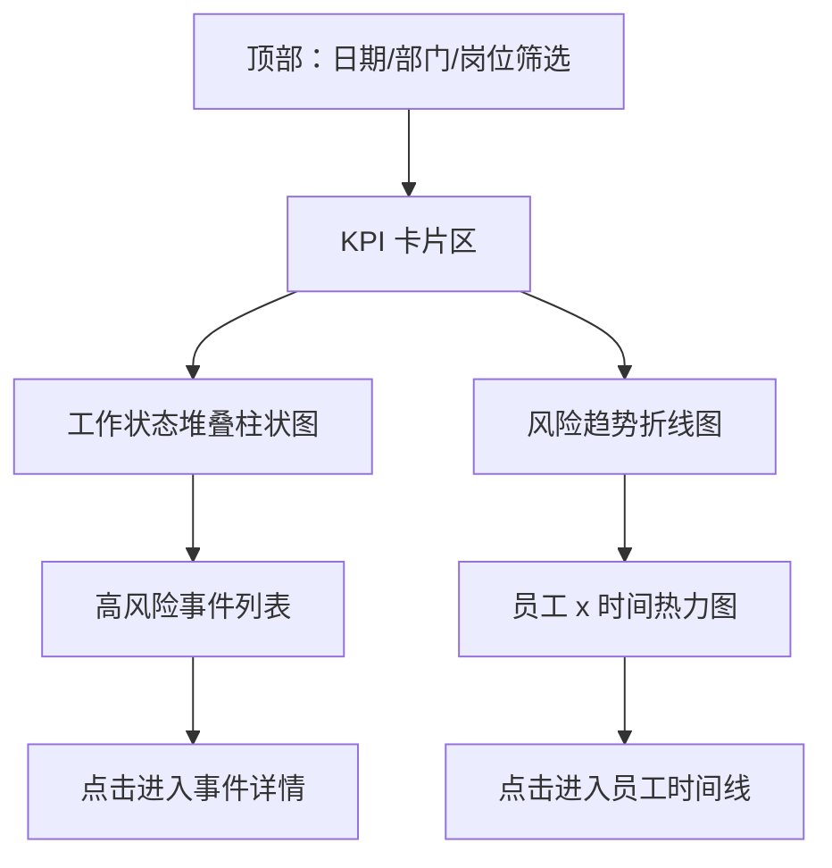
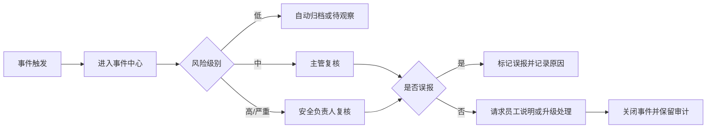
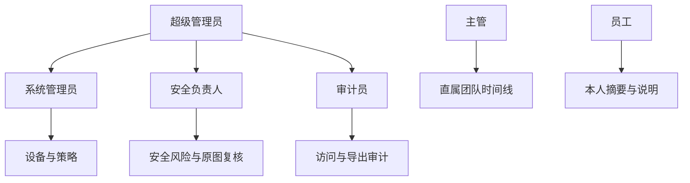

# 技术栈推荐与后台管理规划

## 1. 规划目标

本文补充 PRD 和技术架构，重点回答：

1. MVP 应该使用什么技术栈。
2. 哪些技术栈适合长期演进。
3. 后台管理系统需要哪些模块。
4. 不同管理岗位应该看到什么。
5. 不同员工岗位应该如何配置监控策略。
6. 后台需要哪些图表和数据看板。

当前业务前提：

- 员工是远程全职员工。
- 员工通过远控软件登录公司电脑工作。
- 本系统部署在公司电脑和公司服务器上。
- 本系统不开发远控功能，只采集、分析和记录公司电脑上的工作会话。

## 2. 推荐技术栈总览

### 2.1 MVP 主推方案

| 层级 | 推荐技术 | 说明 |
| --- | --- | --- |
| Windows Agent | C#/.NET Worker Service + WPF/WinUI 托盘 | Windows 集成方便，适合截图、窗口、进程、服务化运行 |
| 后端 API | Python FastAPI | 开发快，适合图像分析、OCR、AI 接入 |
| 异步任务 | Celery/RQ + Redis | 处理截图差分、OCR、事件规则 |
| 数据库 | PostgreSQL | 关系数据、JSON、审计、时间线查询都适合 |
| 对象存储 | MinIO 或云 OSS/COS/S3 | 存截图、缩略图、对比图 |
| 图像处理 | OpenCV + imagehash/scikit-image | pHash、SSIM、分块变化检测 |
| OCR | PaddleOCR | 中文、英文、代码界面识别能力更适合国内场景 |
| 前端 | React + TypeScript | 后台管理生态成熟 |
| UI 组件 | Ant Design | 企业后台表格、表单、权限页成熟 |
| 图表 | Apache ECharts | 时间线、热力图、堆叠柱状图、趋势图能力强 |
| 部署 | Docker Compose | MVP 部署简单，后续可迁移 Kubernetes |

### 2.2 为什么推荐这套

这套方案的重点是“开发速度、图像处理能力、后台效率”的平衡。

- Agent 端用 C#/.NET：因为目标机器主要是 Windows 公司电脑，C# 调 Windows API、服务、托盘、截图和进程信息都更直接。
- 后端用 FastAPI：Python 对 OpenCV、OCR、图像算法、多模态分析更友好。
- PostgreSQL：既能存严肃业务数据，也能用 JSONB 存事件细节。
- MinIO/对象存储：截图不应该直接进数据库。
- React + Ant Design + ECharts：后台管理、表格、筛选、图表、权限页可以快速落地。

### 2.3 Agent 技术路线详细对比

这里重点比较 C#/.NET、Rust、Go 三个候选方案。结论不是 Rust 或 Go 做不了，而是本项目的 Agent 强依赖 Windows 桌面能力，首要目标是“功能稳定可落地”，因此 C#/.NET 的综合确定性最高。

#### 2.3.1 总体结论

| 维度 | C#/.NET | Rust | Go |
| --- | --- | --- | --- |
| 功能可实现性 | 最高 | 高 | 中高 |
| Windows 桌面 API 适配 | 最顺手 | 能做，但样板代码多 | 能做，但生态和示例较少 |
| 截图/多屏/窗口采集 | 成熟，开发快 | 可实现，开发成本高 | 可实现，细节成本高 |
| Windows Service | 成熟 | 可实现 | 成熟 |
| 用户会话 Helper | 成熟 | 可实现 | 可实现 |
| 托盘/本地 UI | WPF/WinUI 成熟 | 需要选 Tauri/原生库 | 可选库较少，体验一般 |
| 上传/缓存/心跳 | 成熟 | 成熟 | 最顺手 |
| 资源占用 | 中等，可接受 | 最低 | 低 |
| 开发难度 | 低到中 | 高 | 中 |
| 维护难度 | 低 | 中高 | 中 |
| 招人/交接 | 容易 | 较难 | 容易 |
| 适合阶段 | MVP + 正式版 | 高安全/高性能重构 | 轻量采集或上传型 Agent |

推荐：

1. MVP：C#/.NET。
2. 后续高安全版本：可以评估 Rust 重写核心采集模块。
3. Go：更适合做服务端、CLI、上传同步器，不建议作为复杂 Windows 桌面 Agent 的第一选择。

#### 2.3.2 功能覆盖对比

| 功能 | C#/.NET | Rust | Go | 判断 |
| --- | --- | --- | --- | --- |
| 定时截图 | 成熟 | 可实现 | 可实现 | C# 开发最快 |
| 多屏截图 | 成熟 | 可实现 | 可实现 | C# 调试成本最低 |
| 前台窗口标题 | P/Invoke 调 Win32 API 简单 | windows crate 可做 | syscall/cgo 可做 | C# 最顺 |
| 进程名/路径 | 成熟 | 成熟 | 成熟 | 三者都可以 |
| 键鼠活动计数 | 成熟 | 可实现 | 可实现 | C# 示例和封装更多 |
| 不记录具体按键 | 容易控制 | 容易控制 | 容易控制 | 三者都可以 |
| 锁屏状态 | WTS/Session API 成熟 | 可实现 | 可实现 | C# 更省事 |
| RDP/远控会话状态 | WTS API 成熟 | 可实现 | 可实现 | C# 更省事 |
| Windows Service 常驻 | Worker Service 成熟 | 可实现 | 成熟 | C# 和 Go 都好 |
| Session 0 与用户桌面分离处理 | Service + User Helper 方案成熟 | 可实现但复杂 | 可实现但复杂 | C# 风险最低 |
| 托盘提示 | WPF/WinUI/NotifyIcon 成熟 | 可实现但选型多 | 可实现但体验一般 | C# 最适合 |
| 本地 SQLite 缓存 | 成熟 | 成熟 | 成熟 | 三者都可以 |
| HTTPS 上传 | 成熟 | 成熟 | 成熟 | 三者都可以 |
| 自动更新 | 可用成熟方案 | 需要设计 | 需要设计 | C# 更企业化 |
| 安装包/MSI | WiX/MSIX/Inno 等成熟 | 可做 | 可做 | C# 周边生态更完整 |
| 文件复制/USB 监控 | 可实现 | 可实现且低层能力强 | 可实现 | Rust 后期有优势 |
| 代码签名/企业分发 | 成熟 | 成熟 | 成熟 | 三者都需要签名 |

最关键的是 `Session 0` 问题：Windows Service 跑在后台服务会话，不能简单假设它能直接拿到当前远程桌面的画面。正确做法是 `Service + User Session Helper`。C# 在这个组合上资料、团队经验和调试工具最成熟。

#### 2.3.3 开发难度对比

| 事项 | C#/.NET | Rust | Go |
| --- | --- | --- | --- |
| Windows API 调用 | 低难度 | 中高难度 | 中高难度 |
| 桌面截图调试 | 低难度 | 中高难度 | 中高难度 |
| 托盘 UI | 低难度 | 中难度 | 中高难度 |
| Service + Helper 通信 | 中难度 | 中高难度 | 中高难度 |
| 本地缓存和队列 | 低难度 | 中难度 | 低难度 |
| 网络上传 | 低难度 | 中难度 | 低难度 |
| 日志和配置 | 低难度 | 中难度 | 低难度 |
| 安装包和自启动 | 中难度 | 中高难度 | 中难度 |
| 团队上手 | 容易 | 慢 | 容易 |

C# 的难点主要在 Windows 权限、Session、截图 API 选择、安装包和企业分发。  
Rust 的难点主要在 Windows API 封装、生命周期、UI/托盘、开发人员能力。  
Go 的难点主要在桌面侧能力：截图、窗口、托盘、Windows 事件和原生体验。

#### 2.3.4 维护问题对比

| 维护维度 | C#/.NET | Rust | Go |
| --- | --- | --- | --- |
| 长期可读性 | 高 | 中 | 高 |
| 内存安全 | 高 | 最高 | 高 |
| 崩溃排查 | 容易 | 中等 | 容易 |
| Windows 版本兼容 | 高 | 中高 | 中 |
| 第三方库稳定性 | 高 | 中 | 中 |
| UI/托盘维护 | 高 | 中 | 中低 |
| 企业 IT 接受度 | 高 | 中高 | 中高 |
| 后续接 DLP 能力 | 中高 | 高 | 中 |
| 人员替换成本 | 低 | 高 | 低 |

维护角度看：

- C#/.NET 的优势是“普通工程师也能接手”，特别适合公司内部长期迭代。
- Rust 的优势是“核心能力更安全、更轻”，但要求团队持续有 Rust 能力。
- Go 的优势是“网络、缓存、心跳、部署简单”，但桌面采集部分会长期依赖较多 Windows API 胶水代码。

#### 2.3.5 三种方案的适配结论

##### C#/.NET 方案

最适合当前项目。

推荐结构：

```text
Windows Service
- 心跳
- 策略拉取
- 上传队列
- 本地缓存
- 日志
- 自动更新

User Session Helper
- 截图
- 多屏识别
- 前台窗口
- 键鼠活动计数
- 锁屏/RDP 状态
- 托盘提示
```

优点：

- Windows 能力最容易做全。
- MVP 速度最快。
- 出问题容易调试。
- 后续维护和招人容易。
- 后台管理、企业分发、日志、安装包生态成熟。

缺点：

- 跨平台不是强项。
- 资源占用高于 Rust/Go。
- 如果做非常底层的安全监控，后期可能不如 Rust/C++ 灵活。

适合：

- 当前 MVP。
- 50-500 台公司 Windows 电脑。
- 需要快速验证截图、变化检测、事件记录的阶段。

##### Rust 方案

适合后期高安全、高性能 Agent。

优点：

- 内存安全最好。
- 资源占用低。
- 单文件部署体验好。
- 做底层文件监控、进程监控、系统事件时潜力大。

缺点：

- Windows 桌面开发成本高。
- 托盘、本地 UI、安装包、Session Helper 都需要更多工程投入。
- 团队要求高，交接成本高。
- MVP 容易被底层细节拖慢。

适合：

- 已经验证业务可行后，对 Agent 做高质量重构。
- 安全要求很高、资源占用要求很低的场景。
- 团队有稳定 Rust 工程能力。

##### Go 方案

适合网络同步型 Agent，不适合做复杂桌面采集的首选。

优点：

- 网络、上传、本地队列、心跳很强。
- 部署简单。
- 并发模型简单。
- 团队上手容易。

缺点：

- Windows 桌面截图、托盘、窗口 API、Session 处理不如 C# 顺手。
- 很多能力要靠 syscall/cgo 或第三方库。
- 做企业桌面客户端体验一般。
- 后续维护时，Windows 相关胶水代码可能变多。

适合：

- 只做轻量心跳、文件上传、日志采集。
- Agent 没有复杂 UI、截图、窗口和会话采集。
- 服务端或边缘同步组件。

#### 2.3.6 最终建议

按当前需求，建议不要在 Agent 首版选 Rust 或 Go。

原因：

1. 本项目首要风险不是性能，而是 Windows 功能能不能稳定跑通。
2. 截图、多屏、窗口、键鼠、锁屏、RDP 会话、托盘提示都偏 Windows 桌面工程。
3. C#/.NET 的工程确定性最高，能最快做出可验证版本。
4. Rust/Go 后期可以作为局部模块替换，而不是第一天就承担完整 Agent。

推荐落地路线：

```text
第一阶段：C#/.NET Agent 做全功能 MVP
第二阶段：稳定后抽象 Agent 协议和采集接口
第三阶段：如有必要，用 Rust 重写高敏感/高性能采集模块
第四阶段：Go 仅用于上传网关、边缘同步器或服务端组件
```

## 3. 技术栈备选方案

### 3.1 后端备选

| 方案 | 优点 | 缺点 | 适用情况 |
| --- | --- | --- | --- |
| FastAPI | 开发快，图像/AI 生态强 | 超大规模并发需要更细调优 | MVP 和中小规模最推荐 |
| Go + Gin/Fiber | 性能高，部署简单 | 图像/OCR/AI 生态不如 Python 直接 | 后期高并发 API 可考虑 |
| Java Spring Boot | 企业标准，权限和审计成熟 | 开发较重，图像分析还要接 Python 服务 | 已有 Java 团队时考虑 |
| Node.js/NestJS | 前后端语言统一 | 图像/OCR 任务通常仍需 Python Worker | 前端团队主导时考虑 |

建议：MVP 用 FastAPI。后期如果 API 压力很大，再把高并发接口拆到 Go，不要一开始过度设计。

### 3.2 前端备选

| 方案 | 优点 | 缺点 |
| --- | --- | --- |
| React + Ant Design | 企业后台成熟，招聘和维护容易 | 风格偏通用，需要定制信息密度 |
| Vue + Element Plus | 国内团队熟悉，后台开发快 | 复杂图表和大型状态管理需规范 |
| Next.js | 路由和工程化强 | 本项目不需要营销页和 SSR，MVP 价值不大 |

建议：React + TypeScript + Ant Design + ECharts。

### 3.3 截图分析方案

| 方案 | 成本 | 准确性 | 说明 |
| --- | --- | --- | --- |
| 纯图片差分 | 低 | 中低 | 只能判断画面变没变，无法判断在做什么 |
| 差分 + 窗口信息 | 低 | 中 | MVP 最基础能力 |
| 差分 + OCR + 规则分类 | 中 | 中高 | MVP 推荐方案 |
| 差分 + OCR + 多模态模型 | 高 | 高 | 只建议用于低置信度或高风险样本复判 |

## 4. 后台管理总体规划

后台不是只看“截图列表”，而是要围绕三件事设计：

1. 当前谁在线、谁异常。
2. 某个人一天到底发生了什么。
3. 哪些风险需要复核和处理。

后台一级菜单建议：

| 模块 | 主要用户 | 目的 |
| --- | --- | --- |
| 总览仪表盘 | 主管、管理员、安全 | 看整体状态和今日风险 |
| 实时状态 | 主管、管理员 | 看当前在线、活跃、锁屏、断连 |
| 员工时间线 | 主管、员工本人 | 看单个员工一天的活动轨迹 |
| 截图分析 | 主管、安全 | 查看截图摘要、前后对比、活动识别 |
| 事件中心 | 主管、安全、审计 | 处理静止、锁屏、断连、泄露风险 |
| GitHub 风险 | 安全、技术负责人 | 看代码访问和仓库异常 |
| 员工与岗位 | HR/管理员 | 管理员工、部门、岗位、主管关系 |
| 策略模板 | 管理员、安全 | 给不同岗位配置不同规则 |
| 权限管理 | 管理员 | 管理后台角色和数据范围 |
| 审计日志 | 审计、安全 | 看谁查看、导出、修改过数据 |
| 系统运维 | 管理员 | Agent、队列、存储、失败任务 |

## 5. 后台角色权限规划

这里说的是“谁登录后台、能看什么”。

| 后台角色 | 可看范围 | 核心权限 | 不应拥有 |
| --- | --- | --- | --- |
| 超级管理员 | 全系统配置 | 初始化系统、创建角色、绑定设备 | 默认不应频繁查看员工原图 |
| 系统管理员 | 设备、Agent、策略 | 管理设备、策略、版本、心跳 | 不应查看安全敏感详情 |
| 直属主管 | 直属团队 | 时间线、事件复核、日报 | 不应查看非直属团队 |
| 项目负责人 | 项目成员 | 项目维度时间线、项目风险 | 不应查看无关项目员工 |
| 安全负责人 | 安全风险范围 | GitHub、DLP、高风险事件、原图复核 | 不应修改普通绩效结论 |
| HR/行政 | 员工基础信息 | 员工状态、部门、岗位、入离职 | 不应查看截图原图 |
| 审计员 | 审计日志 | 查看访问、导出、策略修改记录 | 不应修改业务数据 |
| 员工本人 | 自己的数据 | 查看个人摘要、提交说明/申诉 | 不应查看他人数据 |

权限设计原则：

- 主管看团队，不看全公司。
- 安全看风险，不看日常细节。
- 管理员管系统，不默认看内容。
- 原图查看、截图导出、风险忽略必须单独授权并记录理由。

## 6. 员工岗位与策略模板

这里说的是“被监控员工是什么岗位，应该用什么监控口径”。

不能所有岗位都用同一个“无变化 = 可疑”的规则。研发、测试、运维、产品的正常工作状态差异很大。

### 6.1 岗位模板总表

| 员工岗位 | 正常高频应用 | 正常低变化场景 | 静止事件默认阈值 | 重点风险 |
| --- | --- | --- | --- | --- |
| 后端工程师 | IDE、Terminal、GitHub、数据库工具 | 看日志、等测试、读代码 | N=6，5 分钟高风险 | 大量拉代码、数据库导出、异常压缩 |
| 前端工程师 | IDE、Browser、DevTools、Figma | 调试页面、看设计稿 | N=6，5 分钟高风险 | 访问无关网站、代码复制、构建产物外发 |
| 移动端工程师 | IDE、模拟器、Terminal、GitHub | 等编译、模拟器停留 | N=8，8 分钟高风险 | 包文件外发、证书/密钥泄露 |
| 测试工程师 | Browser、测试工具、Bug 系统、Terminal | 等自动化测试、复现问题 | N=8，8 分钟高风险 | 测试数据导出、截图外发 |
| 运维/SRE | Terminal、监控面板、云控制台、日志平台 | 观察监控、等告警恢复 | N=12，10 分钟高风险 | 生产凭证、云权限、日志导出 |
| 架构师/技术负责人 | 文档、IDE、GitHub、会议 | 读代码、设计、评审 | N=10，10 分钟高风险 | 权限过大、敏感仓库访问 |
| 产品/项目经理 | 文档、任务系统、会议、IM | 看需求、会议、整理文档 | N=12，10 分钟高风险 | 敏感文档外发 |
| UI/设计 | Figma、Photoshop、浏览器、IM | 看设计稿、整理素材 | N=10，10 分钟高风险 | 素材/设计稿外发 |

### 6.2 岗位策略字段

每个岗位模板建议配置：

- 截图间隔。
- 连续无变化阈值 N。
- 高风险持续时长。
- 正常应用白名单。
- 高风险应用黑名单。
- 正常低变化场景。
- GitHub 风险权重。
- 文件外发风险权重。
- 是否启用 OCR。
- 是否启用原图短期保存。
- 是否启用多模态复判。

### 6.3 示例策略

#### 后端工程师

```json
{
  "screenshot_interval_seconds": 10,
  "no_change_threshold": 6,
  "high_risk_duration_minutes": 5,
  "normal_apps": ["IDE", "Terminal", "Browser", "Git Client", "Database Tool"],
  "low_change_contexts": ["documentation", "terminal", "code_review"],
  "github_risk_weight": "high",
  "file_transfer_risk_weight": "high"
}
```

#### 运维/SRE

```json
{
  "screenshot_interval_seconds": 10,
  "no_change_threshold": 12,
  "high_risk_duration_minutes": 10,
  "normal_apps": ["Terminal", "Monitoring", "Cloud Console", "Browser", "IM"],
  "low_change_contexts": ["monitoring", "terminal", "incident_review"],
  "github_risk_weight": "medium",
  "file_transfer_risk_weight": "critical"
}
```

## 7. 后台页面详细规划

### 7.1 总览仪表盘

目标：打开后台第一眼知道今天整体是否正常。

核心卡片：

- 在线设备数。
- 当前活跃员工数。
- 当前锁屏/断连数。
- 今日静止风险事件数。
- 今日高风险事件数。
- 今日 GitHub 风险数。
- Agent 异常数。

核心图表：

- 今日工作状态分布。
- 部门风险趋势。
- 高风险事件排行。
- 设备在线趋势。
- GitHub 异常趋势。

### 7.2 实时状态

目标：看当前谁在线、谁活跃、谁异常。

表格字段：

- 员工。
- 部门。
- 岗位。
- 设备。
- 当前状态。
- 前台应用。
- 当前活动类型。
- 最近截图时间。
- 最近有效变化时间。
- 当前连续无变化次数。
- 风险级别。

筛选：

- 部门。
- 岗位。
- 主管。
- 状态。
- 风险级别。

### 7.3 员工时间线

目标：复盘某员工一天的工作状态。

展示方式：

- 顶部 KPI：工作会话时长、有效变化时长、静止时长、锁屏时长、GitHub 活动数。
- 中部时间轴：按 5 分钟或 10 分钟聚合。
- 下方明细：截图、活动类型、变化级别、事件、备注。

时间线颜色：

- 绿色：正常工作活动。
- 蓝色：会议/沟通。
- 紫色：文档/评审。
- 黄色：低风险静止。
- 橙色：中风险静止。
- 红色：高风险事件。
- 灰色：离线/断连/未知。

### 7.4 截图详情与对比

目标：解释“为什么系统认为这段时间没变化”。

内容：

- 当前截图。
- 上一张截图。
- 差异热区图。
- pHash 距离。
- SSIM。
- 变化块比例。
- 前台应用。
- 窗口标题。
- 键鼠活动计数。
- OCR 摘要。
- 活动分类。
- 判断原因。

### 7.5 事件中心

目标：统一处理所有异常。

事件类型：

- 连续无变化。
- 锁屏超时。
- 远控断连。
- 非工作应用。
- GitHub 大量 clone/fetch。
- 权限变更。
- USB/压缩/外发风险。
- Agent 离线。

事件状态：

- 未处理。
- 复核中。
- 已确认风险。
- 已忽略。
- 员工已说明。
- 已关闭。

事件处理动作：

- 查看证据。
- 指派复核人。
- 添加备注。
- 请求员工说明。
- 标记误报。
- 升级安全事件。

### 7.6 GitHub 风险页

目标：从代码风险角度看异常。

图表：

- 仓库访问热力图。
- clone/fetch 趋势。
- 员工 GitHub 活动趋势。
- 高敏仓库访问排行。
- 非工作时间访问分布。

表格：

- 时间。
- 员工。
- GitHub 用户。
- 仓库。
- 操作类型。
- IP/地区。
- 风险规则。
- 关联截图/工作会话。

### 7.7 策略模板页

目标：按岗位配置不同策略。

能力：

- 创建岗位模板。
- 配置截图间隔。
- 配置连续无变化阈值。
- 配置高风险应用。
- 配置正常应用。
- 配置 GitHub 风险规则。
- 批量应用到员工。
- 查看策略变更历史。

## 8. 图表规划

### 8.1 总览 KPI 卡片

| 指标 | 说明 | 典型图形 |
| --- | --- | --- |
| 在线设备数 | 当前 Agent 在线数 | 数字卡片 + 趋势 |
| 活跃员工数 | 最近 N 分钟有有效变化 | 数字卡片 |
| 静止风险数 | 今日触发静止事件 | 数字卡片 |
| 高风险事件数 | 今日 high/critical 事件 | 数字卡片 |
| GitHub 风险数 | 今日代码风险事件 | 数字卡片 |

### 8.2 工作状态堆叠柱状图

用途：看一天内各类活动占比。

维度：

- X 轴：时间段，例如每小时。
- Y 轴：分钟数。
- 堆叠：编码、评审、会议、文档、沟通、静止、锁屏、未知。

### 8.3 员工 x 时间热力图

用途：快速发现某些员工长时间静止或断连。

维度：

- Y 轴：员工。
- X 轴：时间段。
- 颜色：状态或风险级别。

适合主管日常巡检。

### 8.4 连续无变化分布图

用途：看静止事件是否集中在某些人、岗位或时间段。

图形：

- 直方图：事件持续时间分布。
- 箱线图：不同岗位静止时长差异。
- 排行榜：员工/部门静止事件 Top N。

### 8.5 风险趋势折线图

用途：观察风险是否在变多。

维度：

- X 轴：日期。
- Y 轴：事件数。
- 多条线：静止风险、GitHub 风险、Agent 异常、文件外发风险。

### 8.6 岗位风险矩阵

用途：比较不同岗位是否策略过严或过松。

维度：

- X 轴：平均静止时长。
- Y 轴：高风险事件数。
- 点大小：员工数。
- 颜色：岗位。

### 8.7 GitHub 异常散点图

用途：发现异常访问。

维度：

- X 轴：时间。
- Y 轴：仓库敏感等级或访问量。
- 点大小：clone/fetch 次数。
- 颜色：风险级别。

### 8.8 截图变化折线图

用途：解释某段时间是否真的无变化。

维度：

- X 轴：截图时间。
- Y 轴：变化块比例或 SSIM。
- 标记：事件触发点、恢复变化点。

## 9. 页面结构示意

### 9.1 总览页面布局



### 9.2 事件处理流程



### 9.3 权限关系



## 10. 数据指标定义

### 10.1 工作会话时长

员工远控连接公司电脑并处于登录状态的时间。

### 10.2 有效变化时长

截图之间存在有效变化，或前台应用/键鼠/GitHub 活动表明正在推进工作的时间。

### 10.3 静止时长

连续截图无明显变化的时间。静止不等于一定未工作，需要结合活动类型。

### 10.4 空闲时长

无键鼠活动、无有效截图变化、无工作系统活动的时间。

### 10.5 风险事件数

满足策略规则后生成的事件数量。

### 10.6 复核确认率

人工复核后确认是真风险的比例。这个指标用来校准规则误报。

### 10.7 误报率

人工标记为误报的事件比例。误报率高说明岗位策略需要调整。

## 11. 后台 MVP 优先级

### P0 必须有

- 登录。
- 角色权限。
- 员工管理。
- 设备管理。
- 截图列表。
- 员工时间线。
- 连续无变化事件。
- 事件中心。
- 策略配置。
- 原图查看审计。

### P1 强烈建议

- 总览仪表盘。
- 工作状态堆叠图。
- 员工时间热力图。
- 截图前后对比。
- 员工说明/主管备注。
- GitHub 基础风险页。

### P2 后续增强

- 岗位风险矩阵。
- GitHub 异常散点图。
- 报表导出。
- 飞书/企微告警。
- 多模态复判。
- DLP 文件外发分析。

## 12. 推荐实施顺序

1. 先做 Agent + 截图上传 + 截图列表。
2. 再做变化检测 + 连续无变化事件。
3. 再做员工时间线 + 事件中心。
4. 再做岗位策略模板。
5. 再做仪表盘和图表。
6. 再接 GitHub 风险。
7. 最后接多模态复判和复杂 DLP。

## 13. 官方参考资料

- FastAPI 文档：https://fastapi.tiangolo.com/
- PostgreSQL 文档：https://www.postgresql.org/docs/
- Redis 文档：https://redis.io/docs/latest/
- MinIO 文档：https://min.io/docs/minio/linux/index.html
- React 文档：https://react.dev/
- Ant Design 文档：https://ant.design/docs/react/introduce
- Apache ECharts 文档：https://echarts.apache.org/en/index.html
- GitHub Audit Log 文档：https://docs.github.com/en/organizations/keeping-your-organization-secure/managing-security-settings-for-your-organization/reviewing-the-audit-log-for-your-organization
